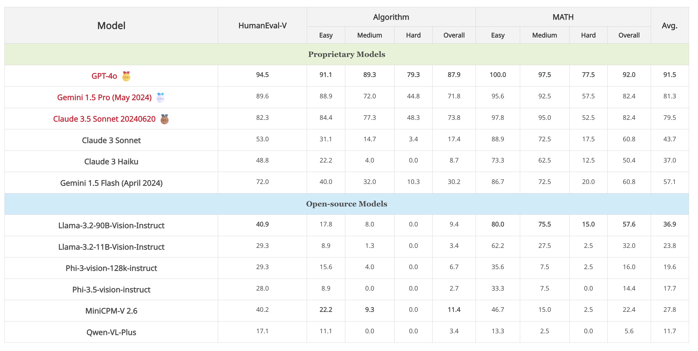

# Code-Vision

Source code for paper [Code-Vision: Evaluating Multimodal LLMs Logic Understanding and Reasoning Capabilities Through Code Generation]()

<p align="center">
    <a href="">📜 Paper</a> •
    <a href="https://drive.google.com/file/d/1aiJB6Z1xQcBAwgcfJFTOUIpf6vVYRsq_/view?usp=sharing">💻 Data </a> •
    <a href="https://pingshengren0901.github.io/codevision.io/">🏆 Leaderboard</a> 
</p>

### Overview

We present **CODE-VISION**, a benchmark designed to evaluate the logical understanding and reasoning capabilities of Multimodal Large Language Models (MLLMs) through code generation. **CODE-VISION** challenges MLLMs to generate a correct program that fulfills specific functionality requirements based on a given flowchart, which visually represents the desired algorithm or process. **CODE-VISION** comprises three subsets—HumanEval-V, Algorithm, and MATH—which evaluate MLLMs' reasoning abilities across basic programming, algorithmic, and mathematical problem-solving domains. Our experiments evaluate 12 MLLMs on **CODE-VISION**. Experimental results demonstrate that there is a large performance difference between proprietary and open-source models. On hard problems, GPT-4o achieves a 79.3% pass@1, while the best open-source model only achieves 15%. Further experiments reveal that **CODE-VISION** poses unique challenges compared to other multimodal reasoning benchmarks, such as MMCode and MathVista. We also investigate the reasons behind the poor performance of open-source models.

### 🏆 [Leaderboard](https://pingshengren0901.github.io/codevision.io/) 🏆

#### Contributing the Leaderboard

🚨🚨 The leaderboard is continuously being updated.

The evaluation instructions are available at 

To submit your results to the leaderboard on Code-Vision, please send to  **wanghanbinpanda@gmail.com** with your result jsonl file and score file, referring to the template files [here](https://github.com/wanghanbinpanda/CodeVision/tree/main/output/Algorithm/gpt-4o).

Leaderboard on **CODE-VISION**:



### Installation

```bash
conda create -n code-vision python==3.10
conda activate code-vision
```

Check out and install requirements.

```bash
git clone https://github.com/wanghanbinpanda/CodeVision.git
cd CodeVision
pip install -r requirements.txt
```

### Download Dataset

The data is stored in [Google Drive](https://drive.google.com/file/d/1aiJB6Z1xQcBAwgcfJFTOUIpf6vVYRsq_/view?usp=sharing) , you can download the **data.zip** to the current directory and then unzip it directly.

Here is an example：

```json
{
  "task_id": "HumanEval-13", 
  "prompt": "\n\ndef greatest_common_divisor(a: int, b: int) -> int:\n    \"\"\" Return a greatest common divisor of two integers a and b\n    >>> greatest_common_divisor(3, 5)\n    1\n    >>> greatest_common_divisor(25, 15)\n    5\n    \"\"\"\n", 
  "entry_point": "greatest_common_divisor", 
  "canonical_solution": "    while b:\n        a, b = b, a % b\n    return a\n", 
  "test": "\n\nMETADATA = {\n    'author': 'jt',\n    'dataset': 'test'\n}\n\n\ndef check(candidate):\n    assert candidate(3, 7) == 1\n    assert candidate(10, 15) == 5\n    assert candidate(49, 14) == 7\n    assert candidate(144, 60) == 12\n", 
  "starter_code": "\n\ndef greatest_common_divisor(a: int, b: int) -> int:"
}
```

We will use task_id to get the image path directly from the image dir.

### Evaluation

1. Complete the model API (or model path) configuration file.

   Add your model config file in [src/configs](https://github.com/wanghanbinpanda/CodeVision/tree/main/src/configs). Here's an example of gpt-4o:

   ```json
   {
       "api_key": "your api key",
       "base_url": "base_url",
       "model": "gpt-4o",
       "max_tokens": 1024,
       "temperature": 0.2,
       "top_p": 0.95,
       "n": 1,
       "stop": []
   }
   ```

2. Configure model path, data path, image path and output path.

   Update model configuration path [API_CONFIG](https://github.com/wanghanbinpanda/CodeVision/blob/9218864209135ab4314a09958007fe83d4fedc1e/src/scripts/evaluate_auto.sh#L12), data path [DATA_PATHS](https://github.com/wanghanbinpanda/CodeVision/blob/9218864209135ab4314a09958007fe83d4fedc1e/src/scripts/evaluate_auto.sh#L14), image path [IMAGE_DIRS](https://github.com/wanghanbinpanda/CodeVision/blob/9218864209135ab4314a09958007fe83d4fedc1e/src/scripts/evaluate_auto.sh#L20), and output path [OUTPUT_DIR](https://github.com/wanghanbinpanda/CodeVision/blob/9218864209135ab4314a09958007fe83d4fedc1e/src/scripts/evaluate_auto.sh#L26C1-L26C11) in [src/scripts/evaluate_auto.sh](https://github.com/wanghanbinpanda/CodeVision/blob/main/src/scripts/evaluate_auto.sh) file.

   If you are using your own model, you will need to complete a generate function in [src/evaluation/evaluate.py](https://github.com/wanghanbinpanda/CodeVision/blob/main/src/evaluation/evaluate.py), here is an [example](https://github.com/wanghanbinpanda/CodeVision/blob/6b64a0dec14ebb81801cc6ee79c36dbf65519d72/src/evaluation/evaluate.py#L60).
3. Running the script.

   ```sh
   bash src/scripts/evaluate_auto.sh
   ```

- How it works:

  ```sh
  Running evaluation with DATA_PATH: data/HumanEval-V/HumanEval.jsonl and IMAGE_DIR: data/HumanEval-V/images
  -------------------- Args --------------------
  {
      "api_config": "src/configs/gemini_api_key_config.json",
      "data_path": "data/HumanEval-V/HumanEval.jsonl",
      "image_dir": "data/HumanEval-V/images",
      "output_dir": "output"
  }
  -------------------- API Config --------------------
  {
      "api_key": "your api key",
      "base_url": "the base url for the api",
      "model": "gemini-1.5-pro-latest",
      "max_tokens": 1024,
      "temperature": 0.2,
      "top_p": 0.95,
      "n": 1,
      "stop": []
  }
  Loading data from data/HumanEval-V/HumanEval.jsonl  total tasks: 164
  Update output dir to output_text_only/HumanEval-V/gemini-1.5-pro-latest
  -------------------- Check existing results --------------------
  Skipping 164 tasks
  Remaining 0 tasks
  -------------------- Starting --------------------
  Generating samples: 100%|█████| 164/164 [10:11<00:00,  0.25it/s]
  Reading samples...
  164it [00:00, 14012.06it/s]
  Running test suites...
  100%|█████| 164/164 [00:33<00:00,  4.85it/s]
  Writing results to output/HumanEval-V/gemini-1.5-pro-latest/samples.jsonl_results.jsonl...
  100%|█████| 164/164 [00:00<00:00, 21584.17it/s]
  {'pass@1': np.float64(0.25609756097560976)}
  
  Running evaluation with DATA_PATH: data/Algorithm/Algorithm.jsonl and IMAGE_DIR: data/Algorithm/images
  ...
  Running evaluation with DATA_PATH: data/MATH/MATH.jsonl and IMAGE_DIR: data/MATH/images
  ...
  ```

### Citation

If you use our code or our data for your research, feel free to cite our publication:

```
@misc{wang2025codevisionevaluatingmultimodalllms,
      title={Code-Vision: Evaluating Multimodal LLMs Logic Understanding and Code Generation Capabilities}, 
      author={Hanbin Wang and Xiaoxuan Zhou and Zhipeng Xu and Keyuan Cheng and Yuxin Zuo and Kai Tian and Jingwei Song and Junting Lu and Wenhui Hu and Xueyang Liu},
      year={2025},
      eprint={2502.11829},
      archivePrefix={arXiv},
      primaryClass={cs.CL},
      url={https://arxiv.org/abs/2502.11829}, 
}
```


### Contact

Please send email to [wanghanbinpanda@gmail.com](mailto:wanghanbinpanda@gmail.com).
